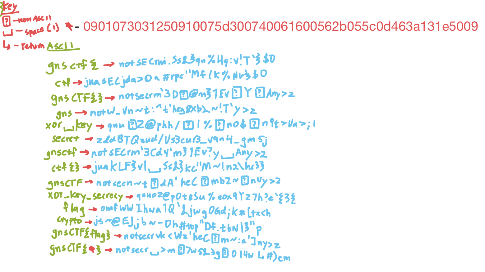

# Dault Voor 2
-Code (current)(WIP):
```cpp

```

# Encyclopedia Knowledge:
-use Wikipedia view version edited by user GnsCtf2 on day Oct 11

Stuck On: Getting the rest of the flag

-flag part located in section gnsCTF2

# Noisy Transmission
-Listen to the morse code
  
-the .wav file is the actual challenge
  
Stuck On: Online decoders get overrun by the amount of static within

# Quiet and falling
-use your inspector and select the element representing the "..." and there
should be an image source tag attached with a mp3 file
  
Stuck On: understanding what this mp3 file actually does

# pwner
-Use pwntools to decipher the \x (hex int escape codes) 
  
Stuck On: \x84 when convertted to ASCII is invalid

# Noot's Flat Earth Tavern
-Command: /flag but disabled because not admin
-finding the right command to give you access as either admin
-finding an exploit to view as admin thus leading us to be able to view
the flag via /flag

# ez
-due to "gets()" not being able to control buffer size, it should be assumed
this problem asking on how to think of a way to trick this program without
crashing it (core dump)
  
Stuck On: Basic Logic down, just gotta actually figure out how to do this

# xor key secrecy
-the key length is unknown

-legit just bruteforcing the key with some guessing

-the presented cipher is the flag not the key

-probable code:
```python
import math

def hamming_distance_bytes(text1: bytes, text2: bytes) -> int:
    dist = 0
    for byte1, byte2 in zip(text1, text2):
        dist += bin(byte1 ^ byte2).count('1')
    return dist
    
def hamming_score_bytes(text1: bytes, text2: bytes) -> float:
    return hamming_distance_bytes(text1, text2) / (8 * min(len(text1), len(text2)))

def compute_key_length(text: bytes) -> int:
    min_score, key_len = None, None
    for klen in range(2, math.ceil(len(text)/2)):
        chunks = [
            text[i: i+klen]
            for i in range(0, len(text), klen)
        ]
        if len(chunks) >= 2 and len(chunks[-1]) <= len(chunks[-2])/2:
            chunks.pop()
        _scores = []
        for i in range(0, len(chunks) - 1, 1):
            for j in range(i+1, len(chunks), 1):
                score = hamming_score_bytes(chunks[i], chunks[j])
                _scores.append(score)
        score = sum(_scores) / len(_scores)
        if min_score is None or score < min_score:
            min_score, key_len = score, klen
    return key_len
    
print(compute_key_length(bytes("0901073031250910075d300740061600562b055c0d463a131e5009", 'utf-8')))
```
  
**Basic Process** First find the length of the ciphertext (in hex) using the hamming distance and then bruteforce it  

Key length should be 24 (bytes)
  
Stuck On: How to bruteforce the key

Key tries:

  
  
# CDN++
-the main program is figuring out a binary format in the extension of the allowed
extensions that will not work with it
  
Stuck On: Actually creating such an image (Maybe corrupting an image?)
  
Known: Image size cannot exceed 16mb

# My World
-does not involve actually loading world into Minecraft
  
-due to the hint being "built somewhere" it should be noted that it should be found
within the folder "poi" (point of interaction) as a binary

# Crappy Bird
-JavaScript injection of the file "data.unity3d"
  
Stuck On: determining the file to alter

# Monochrome Butterfly
-the blocks are in binary (most likely)
  
Stuck On (#1): Is colored = 0 & no color = 1 or the other way?
  
Stuck On (#2): What does the hint mean of R0G5B0? Invertting the colors does not give
you this super dark green color

# SpellingC
-use libc to understand the interactions
  
-use gdb

# bookface
-requires two people to infiltrate the site at once within a limit of 10 minutes to take
down one of the books
  
-books excluded: nottflag
  
Stuck On: determining what this "popular" book is
