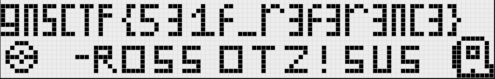

# RiSuAyunda
-answer sequence: `y` | `y` | `31415926535900024685333724635123260888029162081305437033832795028841` | `n` | `y` | `1879192356672253348435765130293352140927781989531481020198546673766426345654011142567837860979525556598757017604728576540647160364587937140263195801545243832809439986532645022057677037910762855325717338581677245387222365851270247202736126599755161321078000206514648543999372922638980374879198040944726993835915237830362427534098786868068100744257865512097199512827926093539210499171426929430381291365207821418816354830788959819939631962268332004243217577857687822392885281354431964523963330286071274566946102491050044852096700865263007628239533169200882797719953955616673579243204805635237794198308486763105365474997` | `y` | `31415926535900024685333724635091844960493264148920744000000000000000` | `y` | `785398163397500617133343115877296124012331603723018600000000000000` | `n` | `y` | `3232897777038406266809592798631059322029606001229363710024725352577854198670998904631189252215464493683300207026412212166661498570243937702916135122285640218873819417559182244640310435013591402695044945345835899107336551297971295653028994962815799843540910414911645281166784657853398284862892647291380938788576630778132151111942103926329576760985179775987116677699452565601345423430775397643292386891991944744282317689222036439405224134526269032825069972396656114618447305459102495077602260474400530762113449248385735074963541396046901963158302829896464863142513388082190462596958309547021229134680788772469064588935` | `y` | `1917483488766730872524699717680578039998465659855612966766` | `y` | `1827773157588910893211615758050479875890264780855699089182060897813707066462441378211301313788811070836652973930817393351132179020003456655878808214548208346477839527002588970638956582475323083806411372493632867749462177530675915039837978534471498989888259077127997216884806540527477420154355350976893336447704297907134879032778480420946040350538641925768233638579016047860517830299326147208660011703654929251687164792332341294650467383399964568496835598498933800121091410129552927381339149927797431065971352701586663780185315188850027281216510673067122341808473307119979547657736504226283300153617603455232235937368285776920004740721319262461200345829176158881774422495479046957931923094715477794555765788556955841917`

The last one I just basically cheesed on and used [this](https://www.dcode.fr/en). The last input was the flag which when convertted to hex then to ascii gives us:
`gnsCTF{yhosh_umm_naah_ai_naah_nyah_hehehe_hmmmm_piripiri_pprrrrr_hmmmm_ID_adopt_me_hmmmm_Hunya_uuuuuuhhh_ayyy_babang_ha_u_u_uhmm_daaaaa_congratulations_yhosh_umm_naah_ai_naahh_nyah_hehehe_hmmmm_piripiri_pprrrrr_hmmmm_ID_Risu_really_happy_hmm_hunya_hehehehe_ayyy_babanggg_hahh_ganbaaaaaaa_Risuuuuuu}`

# pwner
-solved

Solution:
```bash
(printf "\x45\x49\x04\x84\x05\x84\x23\x02\x99\x32\x03\n") | nc gnsctf.ml 4010
```
to get `gnsCTF{r34lly_b1g_k3yb04rd_y0u_g0t_th3r3}`

# shashashasha
-solved

-Solution:
Using [this](https://crackstation.net/)
```
cd0aa9856147b6c5b4ff2b7dfee5da20aa38253099ef1b4a64aced233c9afe29 | g
1b16b1df538ba12dc3f97edbb85caa7050d46c148134290feba80f8236c83db9 | n
043a718774c572bd8a25adbeb1bfcd5c0256ae11cecf9f9c3f925d0e52beaf89 | s
6b23c0d5f35d1b11f9b683f0b0a617355deb11277d91ae091d399c655b87940d | C
e632b7095b0bf32c260fa4c539e9fd7b852d0de454e9be26f24d0d6f91d069d3 | T
f67ab10ad4e4c53121b6a5fe4da9c10ddee905b978d3788d2723d7bfacbe28a9 | F
021fb596db81e6d02bf3d2586ee3981fe519f275c0ac9ca76bbcf2ebb4097d96 | {
18ac3e7343f016890c510e93f935261169d9e3f565436429830faf0934f4f8e4 | d
65c74c15a686187bb6bbf9958f494fc6b80068034a659a9ad44991b08c58f2d2 | o
1b16b1df538ba12dc3f97edbb85caa7050d46c148134290feba80f8236c83db9 | n
e3b98a4da31a127d4bde6e43033f66ba274cab0eb7eb1c70ec41402bf6273dd8 | t
d2e2adf7177b7a8afddbc12d1634cf23ea1a71020f6a1308070a16400fb68fde | _
0bfe935e70c321c7ca3afc75ce0d0ca2f98b5422e008bb31c00c6d7f1f1c0ad6 | u
043a718774c572bd8a25adbeb1bfcd5c0256ae11cecf9f9c3f925d0e52beaf89 | s
3f79bb7b435b05321651daefd374cdc681dc06faa65e374e38337b88ca046dea | e
d2e2adf7177b7a8afddbc12d1634cf23ea1a71020f6a1308070a16400fb68fde | _
043a718774c572bd8a25adbeb1bfcd5c0256ae11cecf9f9c3f925d0e52beaf89 | s
aaa9402664f1a41f40ebbc52c9993eb66aeb366602958fdfaa283b71e64db123 | h
ca978112ca1bbdcafac231b39a23dc4da786eff8147c4e72b9807785afee48bb | a
d2e2adf7177b7a8afddbc12d1634cf23ea1a71020f6a1308070a16400fb68fde | _
acac86c0e609ca906f632b0e2dacccb2b77d22b0621f20ebece1a4835b93f6f0 | l
de7d1b721a1e0632b7cf04edf5032c8ecffa9f9a08492152b926f1a5a7e765d7 | i
8254c329a92850f6d539dd376f4816ee2764517da5e0235514af433164480d7a | k
3f79bb7b435b05321651daefd374cdc681dc06faa65e374e38337b88ca046dea | e
d2e2adf7177b7a8afddbc12d1634cf23ea1a71020f6a1308070a16400fb68fde | _
e3b98a4da31a127d4bde6e43033f66ba274cab0eb7eb1c70ec41402bf6273dd8 | t
aaa9402664f1a41f40ebbc52c9993eb66aeb366602958fdfaa283b71e64db123 | h
ca978112ca1bbdcafac231b39a23dc4da786eff8147c4e72b9807785afee48bb | a
e3b98a4da31a127d4bde6e43033f66ba274cab0eb7eb1c70ec41402bf6273dd8 | t
d2e2adf7177b7a8afddbc12d1634cf23ea1a71020f6a1308070a16400fb68fde | _
6b86b273ff34fce19d6b804eff5a3f5747ada4eaa22f1d49c01e52ddb7875b4b | 1
5feceb66ffc86f38d952786c6d696c79c2dbc239dd4e91b46729d73a27fb57e9 | 0
d4735e3a265e16eee03f59718b9b5d03019c07d8b6c51f90da3a666eec13ab35 | 2
19581e27de7ced00ff1ce50b2047e7a567c76b1cbaebabe5ef03f7c3017bb5b7 | 9
4e07408562bedb8b60ce05c1decfe3ad16b72230967de01f640b7e4729b49fce | 3
7902699be42c8a8e46fbbb4501726517e86b22c56a189f7625a6da49081b2451 | 7
6b86b273ff34fce19d6b804eff5a3f5747ada4eaa22f1d49c01e52ddb7875b4b | 1
d4735e3a265e16eee03f59718b9b5d03019c07d8b6c51f90da3a666eec13ab35 | 2
d10b36aa74a59bcf4a88185837f658afaf3646eff2bb16c3928d0e9335e945d2 | }
```

# Xor Key Secrecy
-solved

Solution: Being that this problem was trivial, the first guess I had from the first hint was deciphering using the key `gnsCTF{}` this gave me a few characters
of the word(s) `notsecr` which I presumed to be `notsecret` which I then used to decipher to get `gnsCTF{us3_s3cur3_k3y5_pl5}`

# My World
-solved

Solution:
-I used a Overhead Minecraft World Renderer [here](https://github.com/Jupisoft111/Minecraft-Overworld-Viewer/releases)
Then I inputted the world file, to get an anomaly in one of the rendered maps:


This image in the renderer lead us with coordinates (X,Z): 2133779, 14206976

Then I just teleported there to get:


# Quiet & Falling
-solved

Solution:
-Find the original recording of this song on YouTube: [here](https://www.youtube.com/watch?v=l4FXoiD2EvI)

-In the comments:


-The text is: `good
nice
serenity
Calming
Terrific
Fun
{
i
talk
'
see
_
quiet
utopia
intent
everything
tranquil
_
dark
only
wonder
now
_
happiness
ecstatic
real
euphoria
}`

Taking the first letter of each word gives us: `gnsCTF{it's_quiet_down_here}`

# Monochrome Butterfly
-solved

Solution: This was based on Image Stego. Using [this](./apps/stegsolve.jar) we can alter between the colors and color phases to reveal 
a QR code:


which when scanned gave us the flag `gnsCTF{h1dd3n_b3tw33n_th3_b1t_pl4n3s}`

# bookface
-solved

Solution: The common web vulnerability was SQL injections which was proved using the injection code of `' or 1=1--` in the password and `admin` for the username. 
This gave us the account access. Which lead us to having the flag of: `gnsCTF{g3t_y0ur_f4c3_0ut_0f_th4t_b00k}`

# Caesura of Despair
-solved

-Solution: The main logic behind it was AES-256-CBC then DES-CBC using openssl (ignore the key derivation used):
```sh
openssl enc -aes-256-cbc -d -salt -in out.enc -out aes.enc -k IRyS

openssl enc -des-cbc -d -salt -in aes.enc -out des.enc -k IRyS
```

getting you the flag of `gnsCTF{d4rkn355_w1ll_f4d3_away_l1ght_w1ll_gu1d3_y0ur_w4y_h0p3_has_descended_and_y0u_are_n0t_al0ne}`

# Tupperware
-solved

Solution: Using the tupper formula, the K value was 
```
7046890806098227958824054035841669579252352373335454688743471323715958682884806244376479723439842411579064508832628408698462207683934029532582388131788110558420326452978938838675781531228566552636252716563201575589499370667467698703660636438713073914155788343459356200698490322930824955282271084327902839457280763892984863984854550620580637272598756700104647089236958308306470745024706826229543234249866440918133382593304731408315133524629092211728447125964550787892317644208636872320053045839269843744148497353297332480357926908259546808320
```
Then using [this](https://github.com/spalaciob/tupper-self-ref-formula) we can then get the flag of:



# fakeimage
-solved

Solution: This was basically I got lucky and spotted a "sus" file which was `etc/apt/sources.list.d/fsfsfs.list` which I knew was not really part
of anything, and when I opened it: 
```

                      _______________________________  ___     .__________          __    ________                 ____                    ________   ___  
   ____   ____   _____\_   ___ \__    ___/\_   _____/ / /    __| _/\   _  \   ____ |  | __\_____  \______    _____/_   | _____   ______    \_____  \   \ \ 
  / ___\ /    \ /  ___/    \  \/ |    |    |    __)   \ \   / __ | /  /_\  \_/ ___\|  |/ /  _(__  <_  __ \  /  ___/|   |/     \ /  ___/      _(__  <   / / 
 / /_/  >   |  \\___ \\     \____|    |    |     \    < <  / /_/ | \  \_/   \  \___|    <  /       \  | \/  \___ \ |   |  Y Y  \\___ \      /       \  > > 
 \___  /|___|  /____  >\______  /|____|    \___  /    / /  \____ |  \_____  /\___  >__|_ \/______  /__|____/____  >|___|__|_|  /____  >____/______  /  \ \ 
/_____/      \/     \/        \/               \/     \_\_      \/        \/     \/     \/       \/  /_____/    \/           \/     \/_____/      \/  _/_/ 
```

which translates to gnsCTF{d0ck3r_s1ms_3}

# Who's that pokemon
-solved

Exploit: Just literally put your cursor over the gif and you could then see the link embedded as the name of the pokemon

# Encyclopedic Knowledge
-solved

Solution: Go to Great Neck South wikipedia page, then go to view histiry and see the edit made by user "GnsCtf2" then scroll down to
find part 1, then go back to the contribs of GnsCtf2 to view other parts to get `gnsCTF{w1k1_15_4_b4d_50urc3}`

# Noot's Flat Earth Tavern
-solved

Solution: Using burpsuite, you basically get Noot's token from one of his messages, then when you are using the `/flag` command, 
replace your token with Noot's token to get gnsCTF{wh4t5_th3_d34l_w1th_s0ck3t10}

# Hackletric Eye
-solved

Solution: The flag is embedded within the file

# Dault Voor Electric Eye
-solved

Solution: Wrote a script that first convertted the bytes back to integer and then moved them to the left (shift)
After this script began to take on meaning, there was comment on the following:
```// My electric eye broke and messed up the bit arrangements... SAD!```
which further confirmed 

# SuperFPG
-solved

Exploit: Since the source code for the player object was posted, the object was titled "Player" this could then gives the following abilities:

`unityInstance.SendMessage("Player", "SetMoves", 999999)`

Then we lure the final guy and we use the above command to finally get the flag of go0d_g8m3_4e5ign

# Crappy Bird
-solved (i thought it was code injection lmao)

Solution: Go to the shope and import data, change the import data to like `9999999999999999999` and then import, this will change the coin count. Once you click play
the flag will appear but you must be quick to take a screenshot of it of `50ON_7O_B3_R3MOV3D`

# Noisy Transmission
-solved

Solution: Look through the `noisy.wav` file through an app like sonic visualizer and then short beams are `.` and longer ones are `_` then put that through a morse to 
text translator to get:
`th1sfl4g1sl0st1nsp4c3`

# DaultVoor2
-solved

Solution: Basically just reading the if statements backwards and transcribing the final backwards (rev)

# ArrSa
-solved

Solution: Integer Factorization 

# Disco Trump
-solved

Solution: Use NATO Phoentic Alphabet 

# Electric Nonsense
-solved

Solution: Vignere Cipher

# next color planet
-solved

Solution: Use an online XOR decoder and stuff


